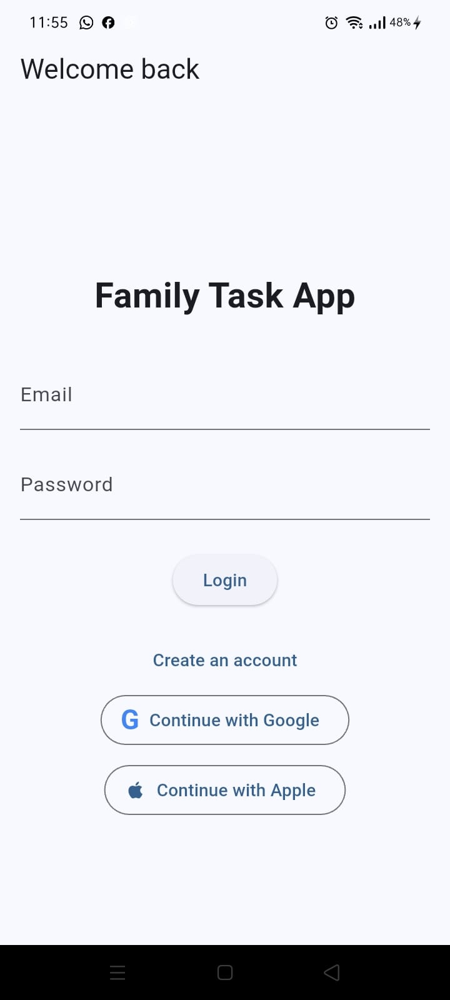
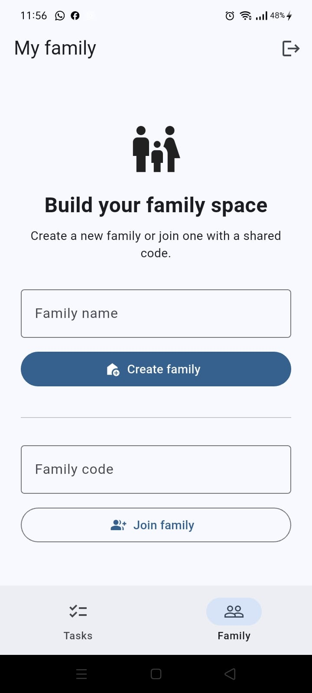
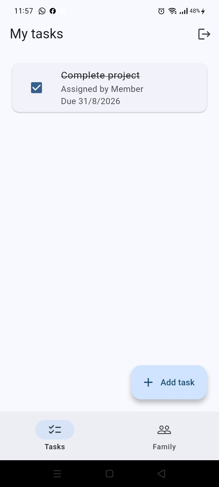

# 👨‍👩‍👧‍👦 Family Task App

> A beautiful, modern Flutter app for collaborative family task management powered by Firebase


## 📋 Overview

Family Task App is a collaborative task management solution designed for families to organize, assign, and track tasks together. Whether you're managing household chores, planning family projects, or coordinating responsibilities, this app makes family task coordination effortless and intuitive.

**Built with modern Flutter architecture patterns, robust Firebase backend, and a focus on user experience.**

---

## ✨ Screenshots

### Login & Authentication
<div align="center">
  
  
</div>

### Family & Task Management
<div align="center">
  
  
</div>

---

## 🎯 Current Features

### ✅ Authentication & Security
- Email/password authentication with Firebase Auth
- Google Sign-In integration
- Apple Sign-In support
- Secure session management
- Externalized Firebase configuration (no hardcoded keys)

### 👨‍👩‍👧‍👦 Family Management
- Create families and invite members
- Join existing families with invite codes
- Family member roster with role tracking
- Seamless family switching for users in multiple families

### ✅ Task Management
- **Personal Tasks**: Private tasks visible only to the user
- **Family Tasks**: Shared tasks assigned to family members
- Create, edit, toggle completion status
- Task persistence across app sessions
- Real-time sync with Firestore

### 🎨 User Experience
- Native splash screen with custom branding
- Clean Material Design 3 UI
- Smooth loading states and transitions
- Responsive layout for various screen sizes
- Optimized startup performance

### 🧪 Code Quality
- 10+ comprehensive unit and widget tests
- Full BLoC/Cubit state management with mocking
- Firebase integration tests
- Dart code analysis compliance

---

## 🛠️ Tech Stack

### Frontend
- **Framework**: Flutter 3.47.0
- **State Management**: BLoC 9.1.1 & Cubit pattern
- **UI Components**: Material Design 3
- **Testing**: flutter_test, mocktail 1.0.5

### Backend & Services
- **Authentication**: Firebase Auth 6.6.1
- **Database**: Cloud Firestore 6.1.0
- **Social Auth**: Google Sign-In 7.2.0, Sign in with Apple 7.0.1
- **Native Splash**: flutter_native_splash 2.4.8

### Build & DevOps
- **Android**: Gradle with Kotlin
- **iOS**: Xcode with Swift
- **Web**: Flutter Web (planned)
- **Configuration**: Externalized Firebase config templates

---

## 📊 Project Status

### 🟢 Completed & Production-Ready
- ✅ User authentication (email, Google, Apple)
- ✅ Family creation and membership
- ✅ Personal & family task management
- ✅ Task visibility after joining family (bug fixed)
- ✅ Loading state optimization (prevents UI flashing)
- ✅ Firebase config externalization for public repos
- ✅ Notification system cleanup (removed unused code)
- ✅ Native splash screen with custom image
- ✅ Comprehensive unit test suite
- ✅ Zero-flashing app startup

### 🟡 In Progress
- Expanding test coverage to all features
- Performance profiling and optimization
- iOS build optimization

---

## 🚀 Future Roadmap

### Phase 2 - Enhanced Task Management
- [ ] Task priority levels (High, Medium, Low)
- [ ] Due dates with push notifications
- [ ] Task categories and tags
- [ ] Recurring tasks (daily, weekly, monthly)
- [ ] Task attachments and comments
- [ ] Task assignment notifications

### Phase 3 - Collaboration & Social
- [ ] Real-time task updates (live sync across devices)
- [ ] Activity feed showing who did what
- [ ] Family achievements and milestones
- [ ] Task completion history and analytics

### Phase 4 - Advanced Features
- [ ] Offline task management with sync
- [ ] Task templates for common routines
- [ ] Family chore rotation system
- [ ] Gamification with points and rewards
- [ ] Dark mode theme

### Phase 5 - Platforms & DevOps
- [ ] Web app (Flutter Web)
- [ ] Desktop apps (macOS, Windows, Linux)
- [ ] Progressive Web App (PWA)
- [ ] Continuous deployment pipeline
- [ ] Remote app configuration

### Phase 6 - Integrations & Analytics
- [ ] Calendar integration (Google Calendar, Apple Calendar)
- [ ] Reminder integrations
- [ ] Third-party calendar sync
- [ ] Usage analytics dashboard
- [ ] Family productivity insights

---

## 🔧 Installation & Setup

### Prerequisites
- Flutter 3.47.0 or higher
- Dart 3.13.0 or higher
- Android Studio / Xcode
- Firebase project with Authentication & Firestore enabled

### Clone & Setup
```bash
# Clone the repository
git clone https://github.com/yourusername/family_task_app.git
cd family_task_app

# Get Flutter dependencies
flutter pub get

# Generate Firebase options (if needed)
# Copy your Firebase credentials to lib/firebase_options.dart

# Run the app
flutter run
```

### Firebase Configuration
1. Create a Firebase project in [Firebase Console](https://console.firebase.google.com)
2. Enable Authentication methods:
   - Email/Password
   - Google Sign-In
   - Apple Sign-In
3. Create a Firestore database in production mode
4. Add Firebase configuration files:
   - Android: `android/app/google-services.json`
   - Web: Configure in `web/firebase-config.js`
5. Update `lib/firebase_options.dart` with your credentials

### Running Tests
```bash
# Run all tests
flutter test

# Run tests with coverage
flutter test --coverage
```

### Building APK/IPA
```bash
# Build debug APK
flutter build apk --debug

# Build release APK
flutter build apk --release

# Build iOS app
flutter build ios
```

---

## 📁 Project Structure

```
lib/
├── main.dart                          # App bootstrap and startup
├── firebase_options.dart              # Firebase configuration
├── core/
│   └── notifications/                 # Notification services
├── features/
│   ├── authentication/
│   │   ├── data/repositories/         # Auth repository
│   │   ├── presentation/
│   │   │   ├── bloc/                  # AuthBloc
│   │   │   └── pages/                 # Login, Auth gate
│   │   └── domain/
│   ├── family/
│   │   ├── data/repositories/         # Family repository
│   │   ├── presentation/
│   │   │   ├── cubit/                 # FamilyCubit
│   │   │   └── pages/                 # Family pages
│   │   └── domain/
│   ├── dashboard/
│   │   └── presentation/pages/        # Dashboard UI
│   └── tasks/
│       ├── data/repositories/         # TodoRepository
│       ├── presentation/
│       │   ├── cubit/                 # TodoCubit
│       │   └── pages/                 # Task pages
│       └── domain/
├── assets/
│   ├── images/
│   │   ├── splash.png                 # Native splash image
│   │   ├── login_screen.jpeg
│   │   ├── family_join_page.jpeg
│   │   └── task_page.jpeg
└── test/                              # Unit and widget tests
```

---

## 🧪 Testing

The app includes comprehensive tests with mocking:

```bash
# Run all tests with verbose output
flutter test -v

# Run specific test file
flutter test test/authentication/auth_bloc_test.dart

# Run tests matching pattern
flutter test --name "auth"
```

### Test Coverage
- **Authentication**: Login/Logout flows, error handling
- **Tasks**: CRUD operations, state management
- **Family**: Member management, state updates
- **Widgets**: UI interactions and rendering

---

## 🔐 Security & Privacy

- ✅ Externalized Firebase configuration (no secrets in repo)
- ✅ Email/password hashing via Firebase Auth
- ✅ Firestore Security Rules (enforce user/family isolation)
- ✅ No hardcoded API keys or tokens
- ✅ Support for OAuth 2.0 authentication

### Configuration Files (Not Committed)
```
├── lib/firebase_options.dart          # .gitignore'd
├── android/app/google-services.json   # .gitignore'd
├── config/firebase_config.json        # Template provided
└── web/firebase-config.js             # Template provided
```

---

## 📱 Platform Support

| Platform | Status | Notes |
|----------|--------|-------|
| Android  | ✅ Supported | Minimum SDK: 21, Target: 34+ |
| iOS      | ✅ Supported | Minimum: iOS 12.0 |
| Web      | 🚀 Planned | Coming in Phase 5 |
| Desktop  | 🚀 Planned | Coming in Phase 5 |

---

## 🤝 Contributing

Contributions are welcome! Please follow these steps:

1. Fork the repository
2. Create a feature branch (`git checkout -b feature/amazing-feature`)
3. Commit your changes (`git commit -m 'Add amazing feature'`)
4. Push to the branch (`git push origin feature/amazing-feature`)
5. Open a Pull Request

### Development Guidelines
- Follow Dart style guide
- Write tests for new features
- Update README for significant changes
- Keep commits focused and descriptive

---

## 📄 License

This project is licensed under the MIT License - see the [LICENSE](LICENSE) file for details.

---

## 🙋 Support & Feedback

- 📧 Report issues via GitHub Issues
- 💬 Discuss ideas in GitHub Discussions
- 🐛 Submit bug reports with reproduction steps
- 💡 Suggest features with use cases

---

## 🎉 Acknowledgments

- Flutter team for the amazing framework
- Firebase for reliable backend services
- BLoC pattern pioneers for state management architecture
- Community for feedback and contributions

---

<div align="center">

**Made with ❤️ for families everywhere**

[⭐ Star us on GitHub](https://github.com/yourusername/family_task_app) | [🐛 Report Issues](https://github.com/yourusername/family_task_app/issues) | [📧 Contact Us](mailto:support@familytaskapp.com)

</div>
