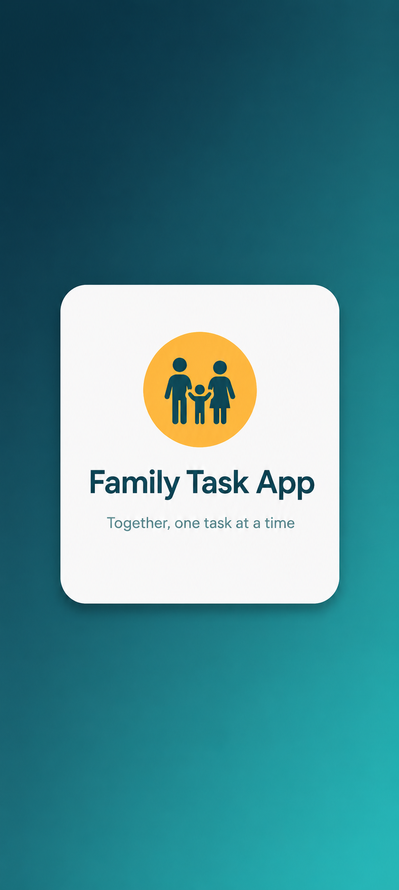
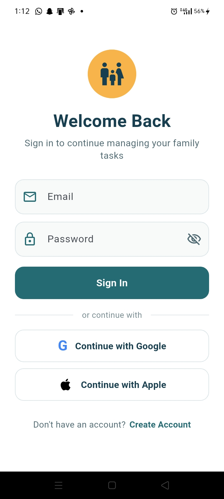
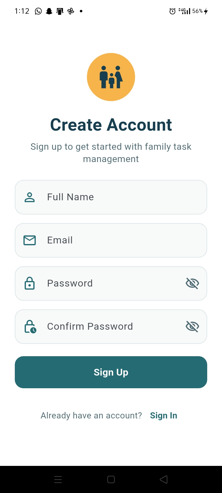
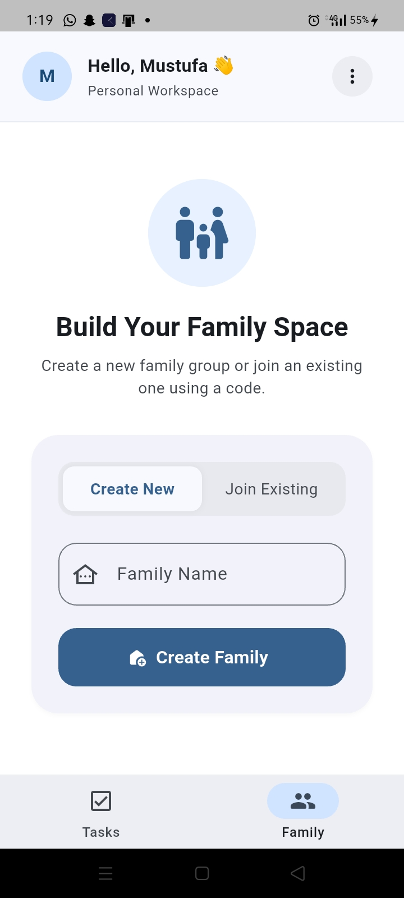
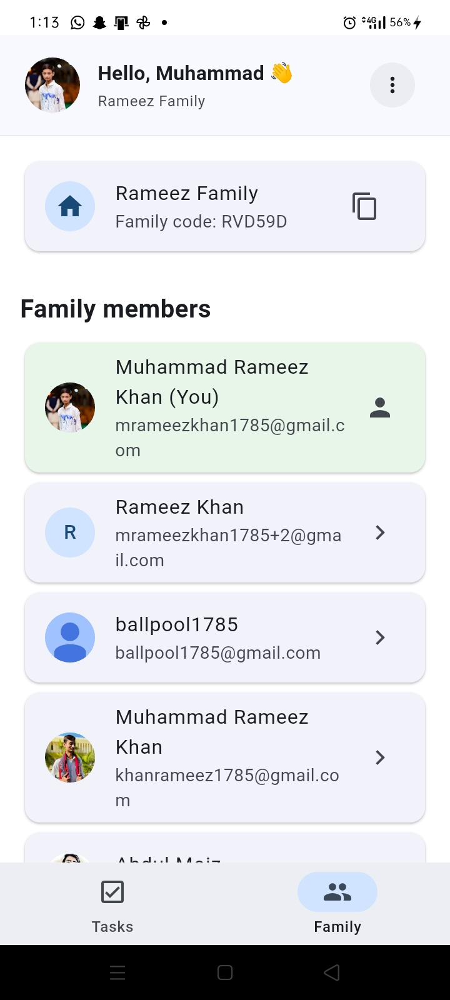
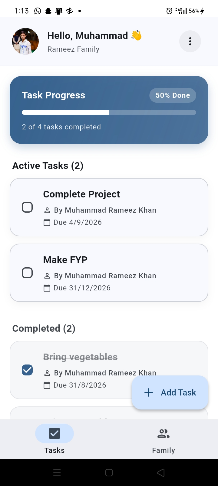

# 👨‍👩‍👧‍👦 Family Task App

> A Flutter + Firebase mobile app for managing tasks within a family.

## 📱 About

**Family Task App** is a Flutter mobile application built with Firebase to help families organize and manage household tasks. The current version includes passwordless email-link authentication, persistent login sessions, family creation/joining, and task management with optional deadlines. Tasks are stored in Cloud Firestore and linked to their creator.

The project is being developed incrementally, with the current focus on building a clean foundation and reliable core functionality. Future development will add task assignment, family member management, task completion and verification, notifications, scoring and rewards, and further UI/UX improvements.

## ✨ Current Features

* 🔐 Passwordless email-link authentication
* 🔗 Android App Links for email authentication
* 💾 Persistent Firebase authentication sessions
* 👨‍👩‍👧‍👦 Create and join a family
* 🏠 Family management
* 📝 Create tasks with a title
* 📅 Optional task deadlines
* 👤 Tasks linked to their creator
* ☁️ Cloud Firestore database
* 🎨 Material 3 UI
* 🚀 Native splash screen
* 🧩 BLoC-based architecture

## 🚀 Future Plans

* 👥 Family member management and roles
* 📌 Assign tasks to family members
* ✅ Task completion and verification
* 🏆 Points, rewards and family achievements
* 🔔 Push notifications and reminders
* 📊 Task progress and activity tracking
* 🌙 Dark / Light theme
* 🎨 Further UI/UX improvements
* 📴 Offline support and synchronization
* 📆 Recurring tasks
* 📎 Task attachments and comments

## 🛠️ Tech Stack

* **Flutter / Dart**
* **BLoC** for state management
* **Firebase Authentication**
* **Cloud Firestore**
* **Firebase Hosting** for authentication link infrastructure
* **Android App Links** for opening authentication links directly in the app

## 📸 Screenshots

### Splash & Authentication

  

### Family Management

  

### Task Management

---

**Built with Flutter & Firebase ❤️**

